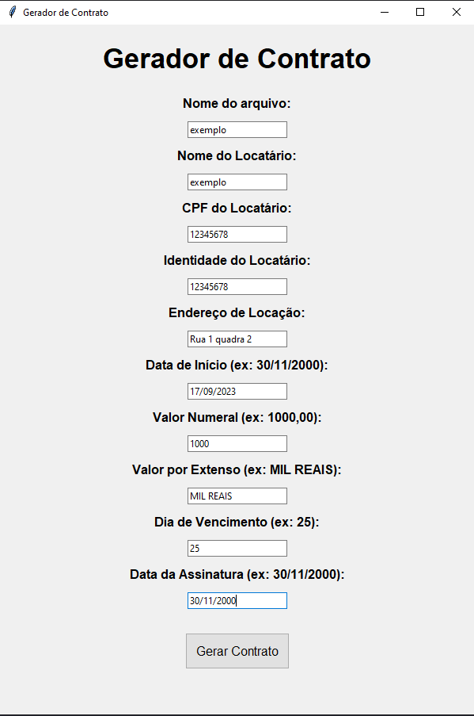

# Gerador de Contratos

English version at the end

Este é um projeto de um gerador de contratos residenciais desenvolvido em Python. Ele fornece uma interface gráfica simples para inserir informações relevantes e gera automaticamente um contrato em formato PDF com base nessas informações. O contrato gerado segue um formato padrão, com cláusulas e condições típicas de contratos de locação residencial no Brasil.



## Funcionalidades

O gerador de contratos permite aos usuários:

1. Inserir o nome do arquivo para salvar o contrato.

2. Preencher as seguintes informações do locatário:
   - Nome
   - CPF
   - Identidade
   - Endereço de locação
   - Data de início da locação
   - Valor do aluguel em formato numeral (exemplo: 1000,00)
   - Valor do aluguel por extenso (exemplo: MIL REAIS)
   - Dia de vencimento do aluguel
   - Data da assinatura do contrato

3. Validar as informações inseridas, garantindo que estão no formato correto.

4. Gerar um contrato em formato PDF com base nas informações inseridas. O contrato gerado incluirá todas as informações necessárias seguindo um formato padrão.

5. Exibir mensagens de erro se alguma informação inserida não estiver no formato correto.

## Requisitos

Para executar o gerador de contratos, você precisará ter o Python instalado em sua máquina. Além disso, as seguintes bibliotecas devem estar instaladas:

- `fpdf`: Uma biblioteca para criar arquivos PDF.

Você pode instalar as bibliotecas usando o pip:

```bash
pip install fpdf
```

## Como Executar

Você tem duas opções para executar o gerador de contratos:

1. **Executar a partir do código-fonte Python:** Você pode executar o programa a partir do código-fonte Python. Basta executar o arquivo `main.py` usando o Python:

    ```bash
    python main.py
    ```

2. **Executar o arquivo executável (main.exe):** Na pasta `dist`, você encontrará um arquivo executável chamado `main.exe`. Isso permite que você execute o programa sem a necessidade de ter o Python instalado. Basta executar o arquivo `main.exe` e a interface gráfica será aberta.

## Utilização

1. Abra o programa.

2. Preencha todas as informações solicitadas na interface gráfica, seguindo os formatos especificados (exemplo: data no formato "dd/mm/aaaa", valor no formato "1000,00").

3. Escolha um nome de arquivo para salvar o contrato. Certifique-se de que o nome contenha apenas letras e números.

4. Clique no botão "Gerar Contrato".

5. O contrato será gerado e salvo no mesmo diretório em que o programa está localizado.

6. Se houver algum erro nas informações inseridas, você receberá uma mensagem de erro explicando o problema.


## Observações

- O contrato gerado segue um formato padrão, mas você pode personalizá-lo ainda mais modificando o código-fonte, se necessário.

- Certifique-se de que as informações inseridas sejam precisas, pois o contrato será gerado com base nessas informações.

- Este projeto é específico para contratos de locação residencial no Brasil e pode não ser adequado para outros tipos de contratos ou outros países.

- O código-fonte completo do projeto está disponível em [https://github.com/Reis567/contract_maker](https://github.com/Reis567/contract_maker). Você pode baixar, modificar e contribuir para o projeto conforme necessário.


### English


# Contract Generator

This is a residential contract generator project developed in Python. It provides a simple graphical interface to enter relevant information and automatically generates a contract in PDF format based on that information. The generated contract follows a standard format with typical clauses and conditions of residential lease agreements in Brazil.


## Features

The contract generator allows users to:

1. Enter the filename to save the contract.

2. Fill in the following tenant information:
   - Name
   - CPF (Brazilian individual taxpayer registry)
   - Identity
   - Rental address
   - Rental start date
   - Rental amount in numeral format (e.g., 1000.00)
   - Rental amount in words (e.g., ONE THOUSAND REAIS)
   - Rental due date
   - Contract signing date

3. Validate the entered information to ensure it is in the correct format.

4. Generate a contract in PDF format based on the entered information. The generated contract will include all necessary information following a standard format.

5. Display error messages if any entered information is not in the correct format.

## Requirements

To run the contract generator, you need to have Python installed on your machine. Additionally, the following libraries must be installed:

- `fpdf`: A library for creating PDF files.

You can install these libraries using pip:

```bash
pip install fpdf
```

## How to Run

You have two options for running the contract generator:

1. **Run from the Python source code:** You can run the program from the Python source code. Simply execute the `main.py` file using Python:

    ```bash
    python main.py
    ```

2. **Run the executable file (main.exe):** In the `dist` folder, you will find an executable file called `main.exe`. This allows you to run the program without needing to have Python installed. Just execute the `main.exe` file, and the graphical interface will open.

## Usage

1. Open the program.

2. Fill in all the required information in the graphical interface, following the specified formats (e.g., date in the format "dd/mm/yyyy," amount in the format "1000.00").

3. Choose a filename to save the contract. Make sure the filename contains only letters and numbers.

4. Click the "Generate Contract" button.

5. The contract will be generated and saved in the same directory where the program is located.

6. If there is any error in the entered information, you will receive an error message explaining the issue.


## Notes

- The generated contract follows a standard format, but you can further customize it by modifying the source code if needed.

- Ensure that the entered information is accurate, as the contract will be generated based on that information.

- This project is specific to residential lease agreements in Brazil and may not be suitable for other types of contracts or other countries.

- The complete source code for the project is available at [https://github.com/Reis567/contract_maker](https://github.com/Reis567/contract_maker). You can download, modify, and contribute to the project as needed.